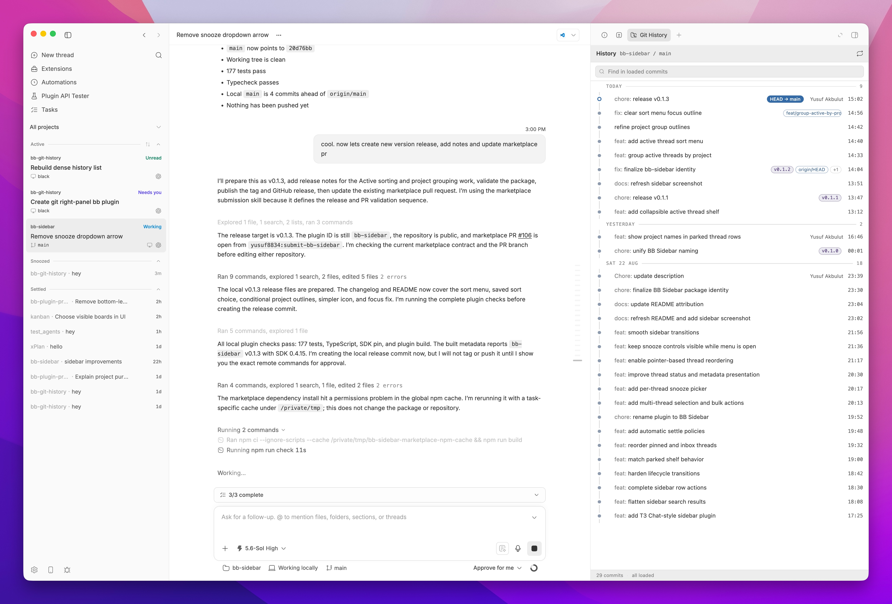
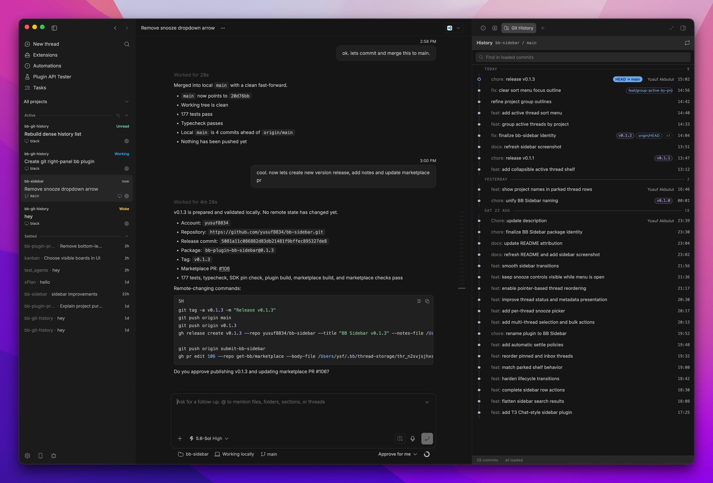

# BB Sidebar

A stable thread list for [bb](https://github.com/get-bb/bb). Threads stay where you put them while status, snooze, settle, and bulk actions remain close at hand.



<details>
<summary>More screenshots</summary>



</details>

## Features

- Manual ordering plus Recent activity, Date created, and Project sort modes
- Subtle project grouping for projects with multiple active threads
- Pinned, Active, Inactive, Snoozed, and Settled shelves
- Project filtering and multi-select bulk actions
- Automatic and per-project custom favicons
- Live status, branch, pull request, and provider details
- Native bb navigation, split, rename, archive, and delete flows

## Install

```sh
bb plugin install git:https://github.com/yusuf8834/bb-sidebar.git
```

Then choose **BB Sidebar** under **Settings > Appearance > Sidebar**.

Project icons use `t3.json`, common favicon and app icon paths, and local icon
metadata. To pick a different image, open BB Sidebar's plugin settings and use
the **Project icons** section. Projects without a matching image keep the
icon-free layout.

The Inactive shelf is enabled by default and moves unpinned threads after six
hours without activity. Both the switch and hour threshold are available in
BB Sidebar's plugin settings.

## Development

```sh
npm install
npm run build
bb plugin install path:. --yes
```

## Credits

This project includes code adapted from [bb-plugin-t3sidebar](https://github.com/SawyerHood/bb-plugin-t3sidebar). Its MIT copyright notice remains in [LICENSE](LICENSE).

The sidebar design and interactions are directly inspired by [T3 Code](https://github.com/pingdotgg/t3code), which is also released under the MIT License. See [THIRD_PARTY_NOTICES.md](THIRD_PARTY_NOTICES.md) for details.
