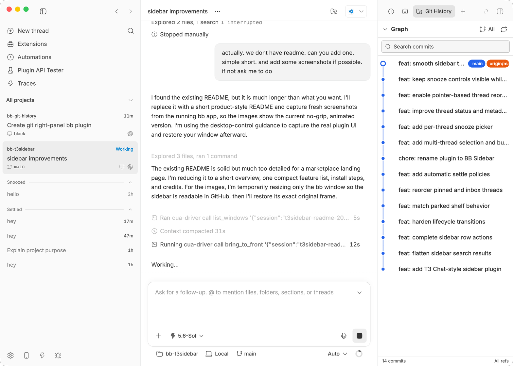

# BB Sidebar

A stable thread list for [bb](https://github.com/get-bb/bb). Threads stay where you put them while status, snooze, settle, and bulk actions remain close at hand.



## Features

- Stable inbox ordering with drag and keyboard reordering
- Pinned, Snoozed, and Settled shelves
- Project filtering and multi-select bulk actions
- Live status, branch, pull request, and provider details
- Native bb navigation, split, rename, archive, and delete flows

## Install

```sh
bb plugin install git:https://github.com/yusuf8834/bb-t3sidebar.git
```

Then choose **BB Sidebar** under **Settings > Appearance > Sidebar**.

## Development

```sh
npm install
npm run build
bb plugin install path:. --yes
```

## Credits

This project includes code adapted from [bb-plugin-t3sidebar](https://github.com/SawyerHood/bb-plugin-t3sidebar). Its MIT copyright notice remains in [LICENSE](LICENSE).

The sidebar design and interactions are directly inspired by [T3 Code](https://github.com/pingdotgg/t3code), which is also released under the MIT License. See [THIRD_PARTY_NOTICES.md](THIRD_PARTY_NOTICES.md) for details.
