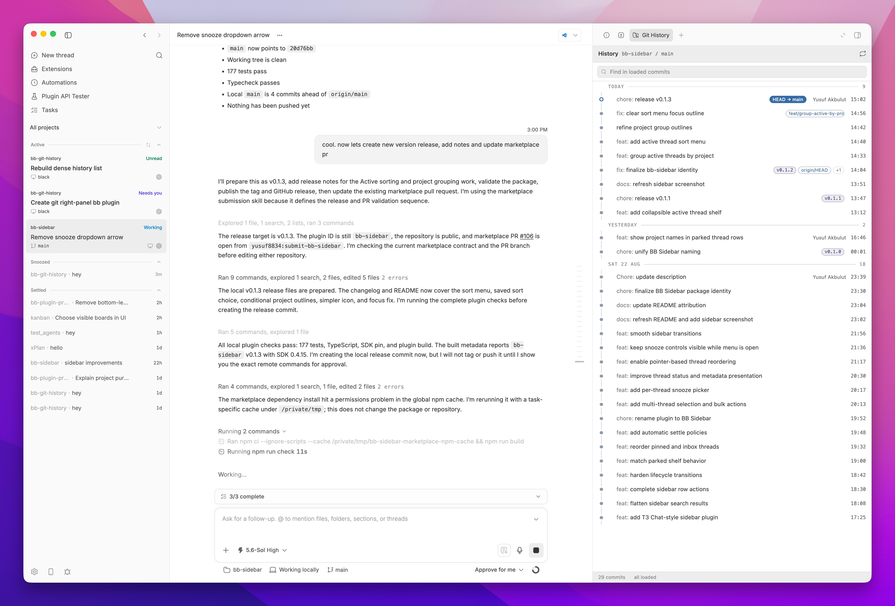
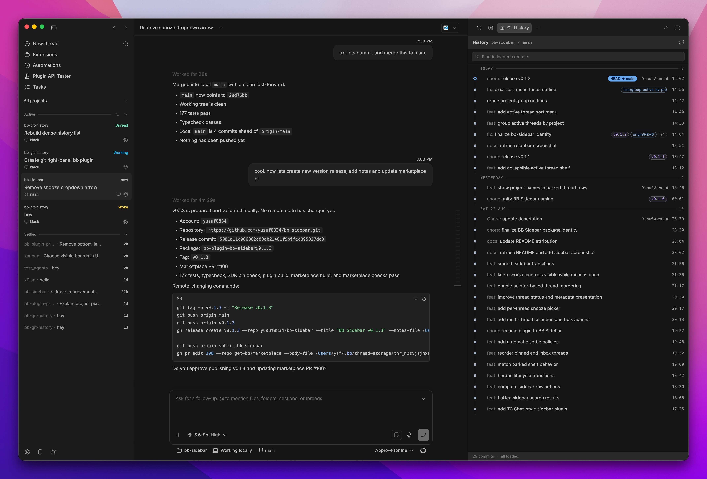
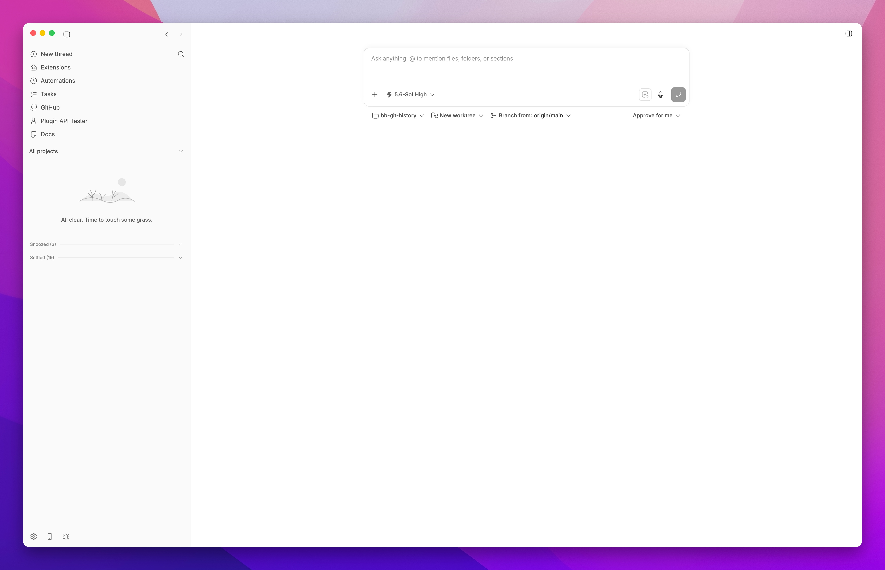

# BB Sidebar

A stable thread list for [bb](https://github.com/get-bb/bb). Threads stay where you put them while status, snooze, and settle actions remain close at hand.







## Features

- Manual ordering plus Recent activity, Date created, and Project sort modes
- Subtle project grouping for projects with multiple active threads
- Pinned, Active, Inactive, Snoozed, Parked, and Settled shelves
- Project filtering
- Optional project colors with per-project color selection. Names stay colored in every mode; show stripes in full and collapsed mode, full mode only, or grouped projects only
- Optional Archived shelf with restore controls and archive buttons on settled threads
- Archived families stay compact in the sidebar; browse children and descendants from the parent thread's header
- Bulk archiving of settled threads from settings
- Automatic project icons with custom overrides
- Expandable child-thread indicators with running and attention states
- Live status, branch, pull request, and provider details
- Workspace port discovery, hover-card details, and optional browser links
- A Clean button in Settled that previews and closes live terminals and verified thread-owned listening ports, while protecting Active and Working threads
- Configurable inactive-thread and automatic cleanup rules
- Native bb navigation, split, rename, archive, and delete flows
- Project submenu on thread cards for settings, rename, local paths, and removal
- Regenerate a thread title from its last three accepted user messages
- Automatically retry missing thread titles once in the background, respecting the selected AI title service and manual edits

## Install

```sh
bb plugin install git:https://github.com/yusuf8834/bb-sidebar.git
```

Then choose **BB Sidebar** under **Settings > Appearance > Sidebar**.

## Development

```sh
npm install
npm run build
bb plugin install path:. --yes
```

## Credits

This project includes code adapted from [bb-plugin-t3sidebar](https://github.com/SawyerHood/bb-plugin-t3sidebar). Its MIT copyright notice remains in [LICENSE](LICENSE).

The sidebar design and interactions are directly inspired by [T3 Code](https://github.com/pingdotgg/t3code), which is also released under the MIT License. See [THIRD_PARTY_NOTICES.md](THIRD_PARTY_NOTICES.md) for details.

Park threads while waiting on someone else. Use **Park thread** in the context menu and **Resume** when ready. Parked threads have no timer and are excluded from automatic cleanup. Opening one leaves it parked; new thread activity brings it back to Active.

Use **Parent** in a thread's context menu to search threads in the same project, choose a parent, or select **None** to remove it. The current parent is checked; the thread itself and its descendants are excluded.

### Contributors

Thank you to everyone who has contributed to BB Sidebar:

- [@a-kras](https://github.com/a-kras): Child threads settings, sorting, and provider icons ([#3](https://github.com/yusuf8834/bb-sidebar/pull/3)); pinned order, animated reordering, child-thread drag and drop, and full thread trees ([#6](https://github.com/yusuf8834/bb-sidebar/pull/6))
- [@amrtawfik160](https://github.com/amrtawfik160): pull-request lookups only for visible rows ([#5](https://github.com/yusuf8834/bb-sidebar/pull/5))
- [@banjerluke](https://github.com/banjerluke): row and card actions on touch devices ([#2](https://github.com/yusuf8834/bb-sidebar/pull/2))
- [@elianiva](https://github.com/elianiva): bounded browser storage and quota-error recovery ([#1](https://github.com/yusuf8834/bb-sidebar/pull/1))
